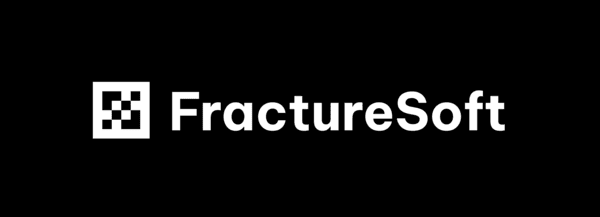

## 🔷 Who are we?

We make games and software designed with the end-user in mind. Every team member is a passionate gamer and free software advocate.
Diversity, equity, and inclusion are core pillars of our team — we have team members from various backgrounds including, but not limited to, the LGBTQIA+ community, women, various nationalities, and many more.

## 🔷 Technologies we use

Each project has unique requirements and challenges, which changes our approach and choice of technologies, but we have a preference for certain styles of tooling:

 

| Use case | Technology | Reasoning |
|:----------|:------------|:-----------|
| Low-level critical software | Rust | Provides a versitile developer ecosystem with strong type and memory safety. |
| Developer tooling | Python or Go | Both technologies provide many libraries which allow tools to be built quickly, Go should be favored over Python for performance sensitive tasks. | 
| User utilities | Rust | Once again a first-in-class technology for building performant and polished software. |
| Games | C# and Godot | Our engine of choice with a familar technology packaged with it. |

## 🔷 Previous work

  <h3><b>Soon™</b></h3>

